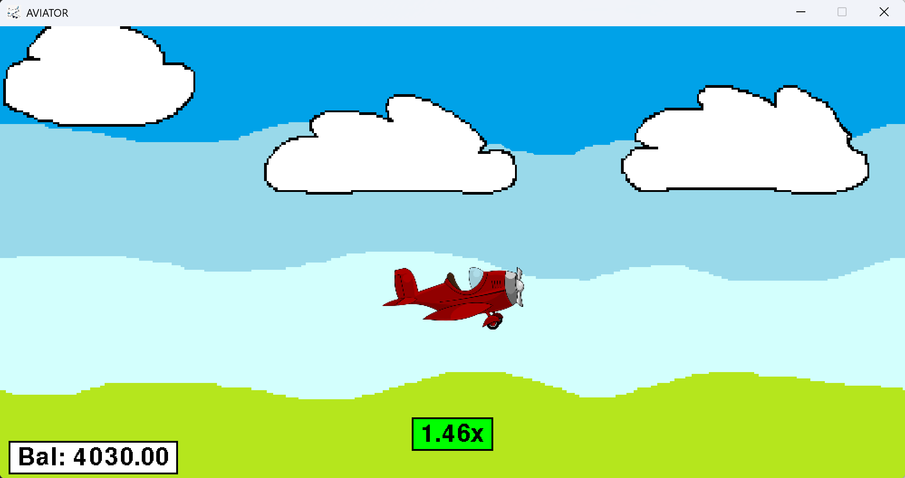

# Aviator Game

This is a simple Aviator-style game written in Python using Pygame.

## Screenshot

## Features

- Betting system
- Multiplier randomizer
- Balance management
- Game history tracking
- Animated airplane and background
- Visual feedback when the target multiplier is reached

## Technologies

- Python
- Pygame

## About

This project was originally created as a personal learning project and later uploaded to GitHub for further development.

This is a casino game where the player places a bet and chooses a multiplier. The multiplier increases until the airplane flies away at a random moment. If the chosen multiplier is lower than the final one, the player wins. Otherwise, the bet is lost.